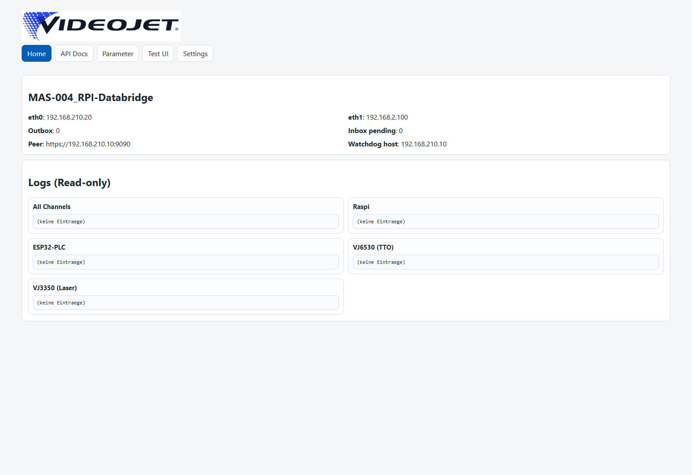
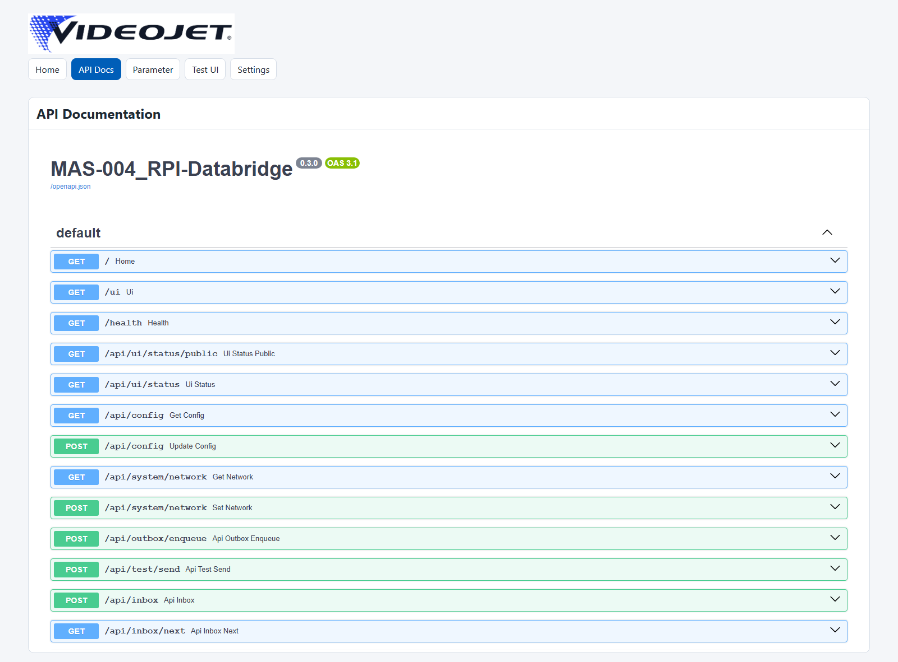
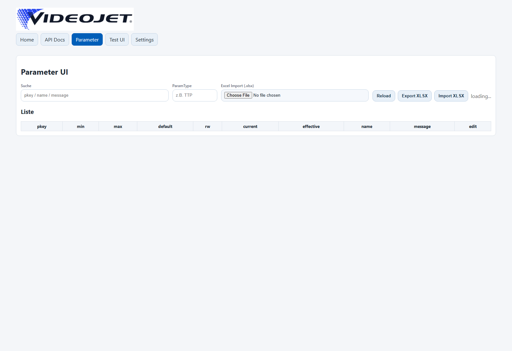
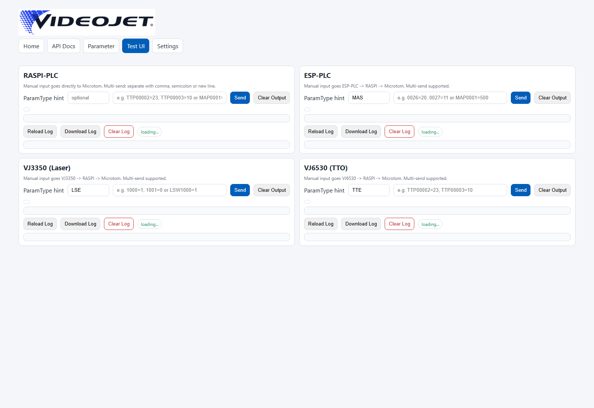

# MAS-004_RPI-Databridge Interface Manual

**Dokumentversion:** 3.0  
**Softwarestand:** MAS-004_RPI-Databridge `0.3.0`  
**Autor:** Erwin Egli  
**Datum:** 2026-02-19  
**System:** Raspberry PLC (Industrial Shields) als Datenbrücke zwischen Microtom und simulierten/realen Subsystemen

## 1. Zweck und Geltungsbereich
Dieses Dokument beschreibt den aktuellen Stand der Applikation `mas004_rpi_databridge` vollständig:

1. Architektur und Nachrichtenfluss.
2. Bedienung der Web-Oberflächen.
3. Vollständige API-Beschreibung aller Endpunkte.
4. Security/TLS, Shared-Secret, Token.
5. Troubleshooting und Betriebschecks.

Die Doku ist für Betrieb, Inbetriebnahme, Test und Erweiterung auf reale Subsysteme (ESP32-PLC, Videojet 3350, Videojet 6530) ausgelegt.

## 2. Aktuelles Zielsystem (Stand 2026-02-19)

### 2.1 Netzwerkadressen
1. Raspi Databridge: `https://192.168.210.20:8080`
2. Microtom Peer (Simulator/Server): `https://192.168.210.10:9090`

### 2.2 Wichtige UI-URLs
1. Home: `https://192.168.210.20:8080/`
2. API Docs: `https://192.168.210.20:8080/docs`
3. Parameter UI: `https://192.168.210.20:8080/ui/params`
4. Settings UI: `https://192.168.210.20:8080/ui/settings`
5. Test UI: `https://192.168.210.20:8080/ui/test`
6. Health: `https://192.168.210.20:8080/health`

## 3. Web-UI Übersicht (mit Screenshots)

### 3.1 Home


### 3.2 API Docs


### 3.3 Parameter UI


### 3.4 Settings UI


### 3.5 Test UI


## 4. Architektur und Datenfluss

### 4.1 Hauptkomponenten
1. **FastAPI Web/API Server** in `mas004_rpi_databridge/webui.py`
2. **Router-Loop** in `mas004_rpi_databridge/router.py`
3. **Sender-Loop / Outbox Worker** in `mas004_rpi_databridge/service.py`
4. **Persistenz (SQLite)** in `mas004_rpi_databridge/db.py`
5. **Parameter- und Regelwerk** in `mas004_rpi_databridge/params.py`
6. **Watchdog/Health** in `mas004_rpi_databridge/watchdog.py`

### 4.2 Persistente Queues
1. **Inbox**: eingehende Requests (dedupliziert über Idempotency-Key)
2. **Outbox**: ausgehende Requests mit Retry/Backoff bis erfolgreichem 2xx

### 4.3 Business-Nachrichtenformat
Allgemein:

```text
<PTYPE><PID>=<WERT>
```

Read:

```text
<PTYPE><PID>=?
```

Beispiele:
1. `TTP00002=?`
2. `TTP00002=50`
3. `MAS0026=20`
4. `LSE1000=1`

### 4.4 Routing-Logik
Prefix-basiert:
1. `TT*` -> Kanal `vj6530`
2. `LS*` -> Kanal `vj3350`
3. `MA*` -> Kanal `esp-plc`
4. sonst -> `raspi`

## 5. Security und Auth

### 5.1 TLS
1. Web/UI/API laufen per HTTPS (`webui_https=true`).
2. Bei IP-Wechsel muss das Zertifikat neu auf die neue IP (SAN) ausgestellt werden.
3. Für Browser ohne Warnung muss `raspi.crt` als vertrauenswürdig importiert werden.

### 5.2 UI-Token (`X-Token`)
1. Fast alle Betriebs-/Konfigurations-APIs sind token-geschützt.
2. Token wird in der Settings-UI in `localStorage` abgelegt (`mas004_ui_token`).

### 5.3 Shared Secret (`X-Shared-Secret`)
1. Gilt für eingehendes `POST /api/inbox` (Microtom -> Raspi).
2. Ist `shared_secret` in Config gesetzt, ist Header Pflicht.
3. Ist `shared_secret` leer, ist Prüfung deaktiviert.

### 5.4 Idempotency
1. `X-Idempotency-Key` für robuste Retry-Strategie.
2. Inbox dedupliziert über UNIQUE-Key.
3. Callback-Korrelation über `X-Correlation-Id`.

<div class="page-break"></div>

## 6. API-Gesamtübersicht

### 6.1 Öffentliche Endpunkte (ohne Token)
1. `GET /`
2. `GET /ui`
3. `GET /docs`
4. `GET /docs/swagger`
5. `GET /ui/params`
6. `GET /ui/settings`
7. `GET /ui/test`
8. `GET /ui/assets/videojet-logo.jpg`
9. `GET /health`
10. `GET /api/ui/status/public`
11. `POST /api/inbox` (optional Shared-Secret)

### 6.2 Token-geschützte Endpunkte
1. `GET /api/ui/status`
2. `GET /api/config`
3. `POST /api/config`
4. `GET /api/system/network`
5. `POST /api/system/network`
6. `POST /api/outbox/enqueue`
7. `POST /api/test/send`
8. `GET /api/inbox/next`
9. `POST /api/inbox/{msg_id}/ack`
10. `POST /api/params/import`
11. `GET /api/params/export`
12. `GET /api/params/list`
13. `POST /api/params/edit`
14. `GET /api/ui/logs/channels`
15. `GET /api/ui/logs`
16. `POST /api/ui/logs/clear`
17. `GET /api/ui/logs/download`
18. `GET /api/logfiles/list`
19. `GET /api/logfiles/download`

## 7. Vollständige API-Referenz

## 7.1 UI und Basis

### `GET /`
1. Liefert Home-HTML mit Live-Countern für Outbox/Inbox.
2. Keine Auth.

### `GET /ui`
1. Alias auf Home.
2. Keine Auth.

### `GET /docs`
1. Wrapper-Seite mit eingebettetem Swagger (`/docs/swagger`).
2. Keine Auth.

### `GET /docs/swagger`
1. FastAPI Swagger UI.
2. Keine Auth.

### `GET /ui/assets/videojet-logo.jpg`
1. Liefert Logo-Asset.
2. Keine Auth.
3. `404`, falls Datei fehlt.

### `GET /health`
Response:

```json
{"ok": true}
```

## 7.2 Status API

### `GET /api/ui/status/public`
1. Keine Auth.
2. Für Home-Liveanzeige.

Response:

```json
{
  "ok": true,
  "outbox_count": 0,
  "inbox_pending": 0
}
```

### `GET /api/ui/status`
1. Header: `X-Token`
2. Liefert Betriebsstatus inkl. Device-Konfiguration.

Response (Beispiel):

```json
{
  "ok": true,
  "outbox_count": 0,
  "inbox_pending": 0,
  "peer_base_url": "https://192.168.210.10:9090",
  "devices": {
    "esp": {"host": "", "port": 0, "simulation": true, "watchdog_host": ""},
    "vj3350": {"host": "", "port": 0, "simulation": true},
    "vj6530": {"host": "", "port": 0, "simulation": true}
  }
}
```

## 7.3 Konfiguration

### `GET /api/config`
1. Header: `X-Token`
2. Liefert komplette Runtime-Konfiguration.
3. `ui_token` und `shared_secret` werden maskiert (`***`).

### `POST /api/config`
1. Header: `X-Token`
2. Body: partielles JSON gemäß `ConfigUpdate`.
3. Speichert Config und startet Service neu.

Body-Felder (`ConfigUpdate`):
1. `peer_base_url`, `peer_watchdog_host`, `peer_health_path`
2. `tls_verify`, `http_timeout_s`, `eth0_source_ip`
3. `webui_port`, `ui_token`, `shared_secret`
4. `esp_host`, `esp_port`, `esp_simulation`, `esp_watchdog_host`
5. `vj3350_host`, `vj3350_port`, `vj3350_simulation`
6. `vj6530_host`, `vj6530_port`, `vj6530_simulation`
7. `logs_keep_days_all`, `logs_keep_days_esp`, `logs_keep_days_tto`, `logs_keep_days_laser`

Response:

```json
{"ok": true}
```

## 7.4 Netzwerk

### `GET /api/system/network`
1. Header: `X-Token`
2. Liefert gespeicherte Netzwerkconfig und live erkannte IP/GW Infos.

### `POST /api/system/network`
1. Header: `X-Token`
2. Body gemäß `NetworkUpdate`:
   1. `eth0_ip`, `eth0_prefix`, `eth0_gateway`, `eth0_dns`
   2. `eth1_ip`, `eth1_prefix`, `eth1_gateway`, `eth1_dns`
   3. `apply_now` (bool)
3. Validiert DNS auf IPv4-Format.
4. Speichert Config.
5. Optional `apply_now`: versucht Live-Anwendung über `dhcpcd/nmcli`.

Beispiel:

```json
{
  "eth0_ip": "192.168.210.20",
  "eth0_prefix": 24,
  "eth0_gateway": "192.168.210.1",
  "eth0_dns": "10.28.193.4 10.27.30.201",
  "eth1_ip": "192.168.2.100",
  "eth1_prefix": 24,
  "eth1_gateway": "",
  "eth1_dns": "",
  "apply_now": true
}
```

## 7.5 Outbox/Test/Inbox

### `POST /api/outbox/enqueue`
1. Header: `X-Token`
2. Body (`OutboxEnqueue`):
   1. `method` (Default `POST`)
   2. `path` (Default `/api/inbox`)
   3. `url` (optional, überschreibt `path`)
   4. `headers` (JSON)
   5. `body` (JSON)
   6. `idempotency_key` (optional)
3. Legt Job in Outbox an.

### `POST /api/test/send`
1. Header: `X-Token`
2. Body (`TestSendReq`):
   1. `source`: `raspi|esp-plc|vj3350|vj6530`
   2. `msg`: Einzel- oder Mehrfachnachricht (Komma/Semikolon/Zeilenumbruch)
   3. `ptype_hint`: optional, 3 Buchstaben
3. Persistiert schreibende Parameternachrichten lokal (wenn erlaubt) und queued Versand an Peer.

Beispiel:

```json
{
  "source": "vj6530",
  "msg": "TTP00002=23, TTP00003=10",
  "ptype_hint": "TTP"
}
```

### `POST /api/inbox`
1. Keine Token-Auth.
2. Optional Header `X-Shared-Secret` (wenn aktiv).
3. Optional Header `X-Idempotency-Key`.
4. Akzeptiert JSON oder Plaintext.
5. Speichert in Inbox dedupliziert.

Response:

```json
{
  "ok": true,
  "stored": true,
  "idempotency_key": "..."
}
```

Fehler:
1. `401 Unauthorized (shared secret)` bei falschem/fehlendem Secret.

### `GET /api/inbox/next`
1. Header: `X-Token`
2. Debug: nächste pending Inbox-Nachricht.

### `POST /api/inbox/{msg_id}/ack`
1. Header: `X-Token`
2. Markiert Nachricht als erledigt.

## 7.6 Parameter API

### `POST /api/params/import`
1. Header: `X-Token`
2. Multipart Upload Feld `file`.
3. Nur `.xlsx` erlaubt.
4. Importiert Parametertabelle inkl. Regeln.

### `GET /api/params/export`
1. Header: `X-Token`
2. Query optional: `ptype`, `q`
3. Download als `params_export.xlsx`.

### `GET /api/params/list`
1. Header: `X-Token`
2. Query:
   1. `ptype` optional
   2. `q` optional
   3. `limit` default `200`
   4. `offset` default `0`
3. Liefert Parameterliste für UI-Tabelle.

### `POST /api/params/edit`
1. Header: `X-Token`
2. Body (`ParamEdit`):
   1. `pkey` (Pflicht)
   2. `default_v` optional
   3. `min_v` optional
   4. `max_v` optional
   5. `rw` optional (`R|W|R/W`)
3. Validiert und aktualisiert Metadaten.
4. `400` bei ungültigen Eingaben.

## 7.7 Log APIs

### `GET /api/ui/logs/channels`
1. Header: `X-Token`
2. Liefert bekannte Logkanäle.

### `GET /api/ui/logs`
1. Header: `X-Token`
2. Query:
   1. `channel` (Pflicht)
   2. `limit` default `250`
3. Liefert Logeinträge als JSON.

### `POST /api/ui/logs/clear`
1. Header: `X-Token`
2. Query: `channel` (Pflicht)
3. Löscht Kanal-Log.

### `GET /api/ui/logs/download`
1. Header: `X-Token`
2. Query: `channel` (Pflicht)
3. Download als `<channel>.log`.

### `GET /api/logfiles/list`
1. Header: `X-Token`
2. Wendet Retention an und listet Tagesdateien.

### `GET /api/logfiles/download`
1. Header: `X-Token`
2. Query: `name` (Pflicht)
3. Download einer Tagesdatei.
4. `404` falls Datei nicht vorhanden.

## 8. Microtom-Schnittstelle (fachlich)

### 8.1 Microtom -> Raspi
Empfohlener Aufruf:

```bash
curl -k -X POST "https://192.168.210.20:8080/api/inbox" \
  -H "Content-Type: application/json" \
  -H "X-Idempotency-Key: mt-20260219-0001" \
  -H "X-Shared-Secret: <SECRET>" \
  -d "{\"cmd\":\"TTP00002=?\",\"source\":\"microtom\"}"
```

### 8.2 Raspi -> Microtom Callback
Raspi sendet an `peer_base_url + /api/inbox`, z. B.:
1. URL: `https://192.168.210.10:9090/api/inbox`
2. Body: `{"msg":"TTP00002=55","source":"raspi"}`
3. Header: `X-Idempotency-Key`, `X-Correlation-Id`

Microtom muss auf 2xx antworten, sonst bleibt Nachricht in Outbox und wird erneut versucht.

## 9. Performance und Zuverlässigkeit

### 9.1 Aktuelle Optimierungen
1. Persistenter HTTP-Client mit Connection-Reuse.
2. Schnellere Sender-/Router-Loop-Pollingzeiten.
3. Health-Endpoint als primäre Watchdog-Quelle.
4. Verbesserte Outbox-Reihenfolge (`next_attempt`, `retry_count`, `created_ts`).
5. Ungültige URLs werden verworfen statt ewig retried.

### 9.2 Relevante Config-Felder
1. `http_timeout_s`
2. `watchdog_interval_s`
3. `watchdog_timeout_s`
4. `watchdog_down_after`
5. `retry_base_s`
6. `retry_cap_s`
7. `tls_verify`
8. `eth0_source_ip`

## 10. Betrieb: Git/Deploy

### 10.1 Lokal -> Remote
```powershell
git add .
git commit -m "Update docs"
git push origin main
```

### 10.2 Raspi Update
```bash
cd /opt/MAS-004_RPI-Databridge
git pull --ff-only
sudo systemctl restart mas004-rpi-databridge.service
sudo systemctl status mas004-rpi-databridge.service
```

## 11. Troubleshooting

### 11.1 Outbox bleibt > 0
Prüfen:

```bash
sudo sqlite3 /var/lib/mas004_rpi_databridge/databridge.db \
"SELECT id,method,url,retry_count,datetime(next_attempt_ts,'unixepoch','localtime') FROM outbox ORDER BY id;"
```

Typischer Fall: alte Peer-IP in URL (z. B. `192.168.1.x`) führt zu Timeouts.

### 11.2 Service langsam oder verzogert
Prüfen:

```bash
sudo journalctl -u mas004-rpi-databridge.service -n 200 --no-pager | grep "\[OUTBOX\]"
```

### 11.3 DNS/Routing Probleme
Prüfen:

```bash
ip route
cat /etc/resolv.conf
getent hosts github.com
```

### 11.4 Browser zeigt "Nicht sicher"
1. Zertifikat neu mit aktueller IP/SAN erstellen.
2. `raspi.crt` in Windows Root-Store importieren.
3. Browser neu starten.

## 12. Erweiterung auf reale Geräte
Aktuell sind ESP/VJ3350/VJ6530 in Simulation möglich. Für reale Anbindung:

1. Device-Endpunkte in Settings setzen.
2. Protokolladapter aktivieren/erweitern (`device_bridge.py`).
3. Parameter-Mapping aus der XLSX-Tabelle pflegen.
4. Kommunikations- und Fehlerfälle pro Gerät testen.

## 13. Änderungslog
1. **v3.0 (2026-02-19):** Vollständige API-Beschreibung aller Endpunkte, neue IP-Umgebung `192.168.210.x`, UI-Screenshots, aktualisierte Betriebs- und Security-Kapitel.
